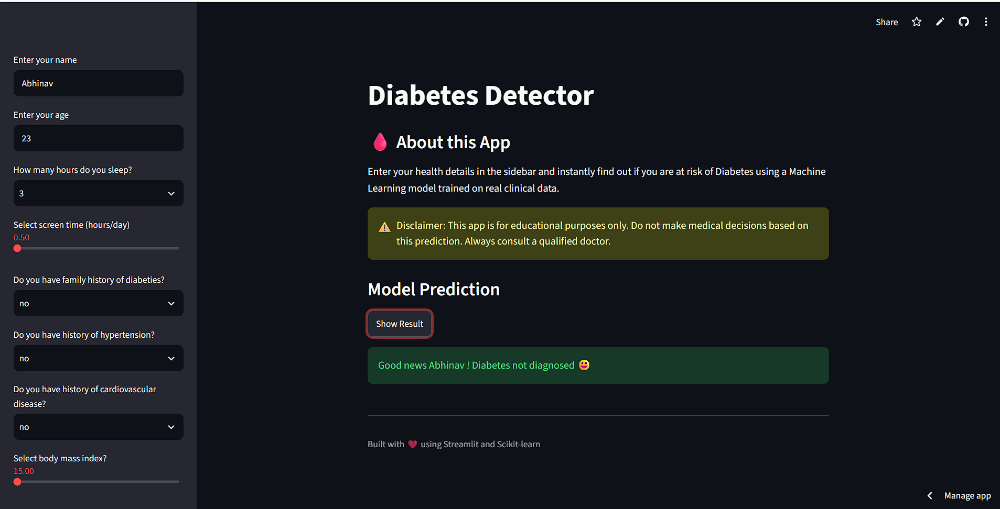
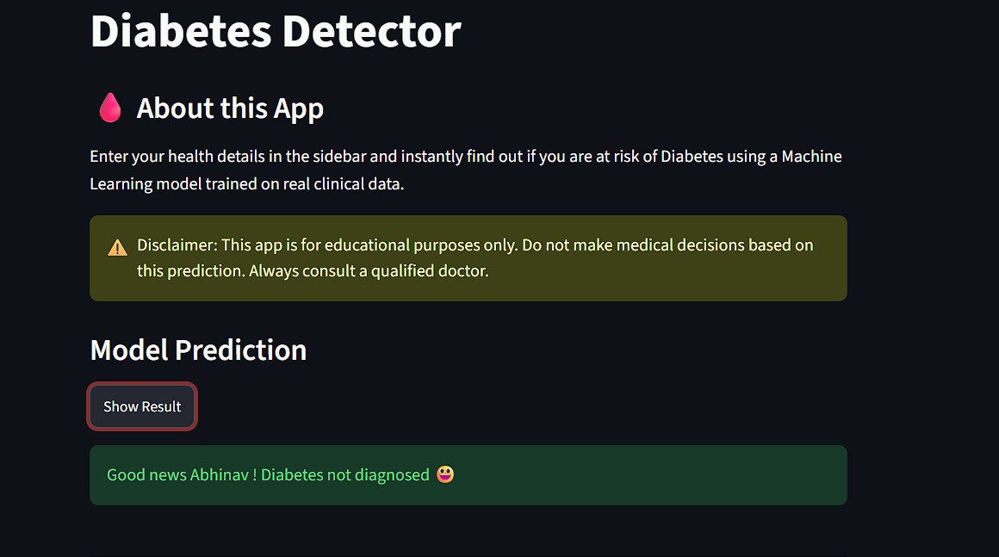

# 🩺 Diabetes Detector

A Streamlit web application that predicts diabetes risk using a Logistic Regression model trained on clinical and lifestyle data.

## 🚀 Features
- Predicts diabetes risk from user inputs
- Interactive Streamlit interface
- Logistic Regression model
- Data preprocessing using StandardScaler
- Fast and user-friendly web application

## 🛠️ Tech Stack
- Python
- Streamlit
- Scikit-learn
- Pandas
- NumPy

## 📂 Project Structure

```text
diabetes-detector/
├── diabetes.ipynb
├── ui_diabetes_status.py
├── logistic_regression_model.joblib
├── scaling.joblib
├── requirements.txt
├── s11.png
├── s22.png
├── README.md
└── LICENSE
```

## 📸 Application Screenshots

### Home Page


### Prediction Result


## ⚙️ Installation

```bash
git clone https://github.com/your-username/diabetes-detector.git
cd diabetes-detector
pip install -r requirements.txt
streamlit run ui_diabetes_status.py
```

## 📊 Machine Learning Model

- **Algorithm:** Logistic Regression
- **Preprocessing:** StandardScaler
- **Features:** Clinical and lifestyle data
- **Output:** Diabetes Risk Prediction

## 📌 How to Use

1. Launch the Streamlit application.
2. Enter the required health and lifestyle information.
3. Click the **Predict** button.
4. View the diabetes risk prediction instantly.

## 📄 License

This project is licensed under the MIT License.
